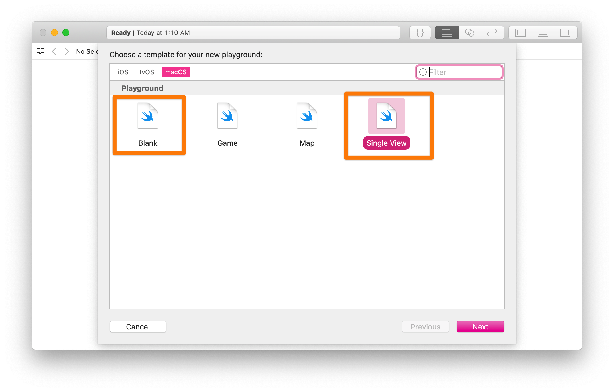
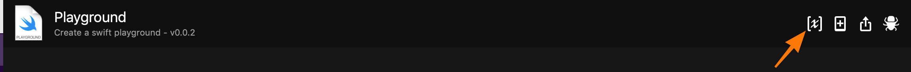
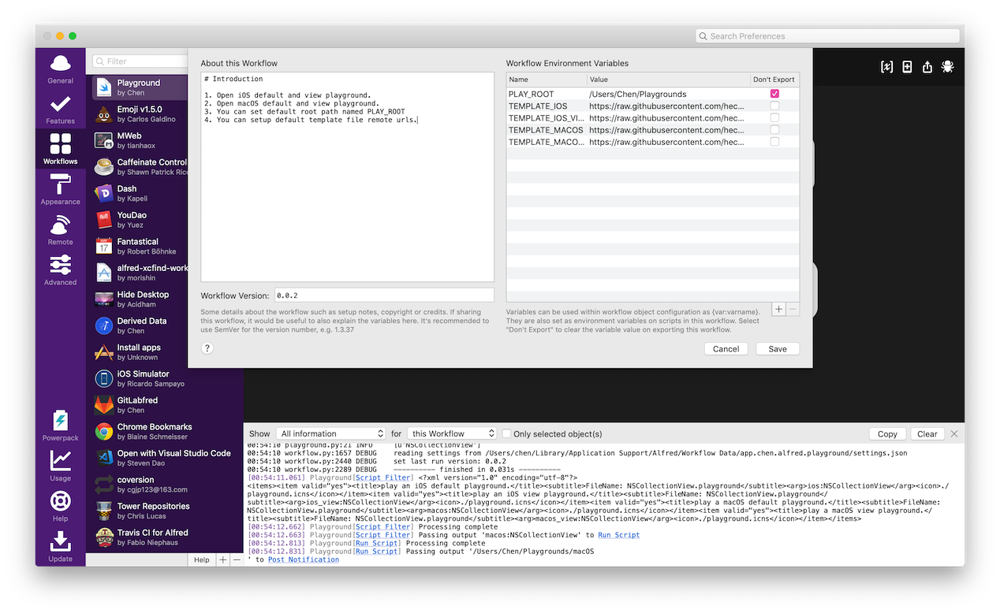
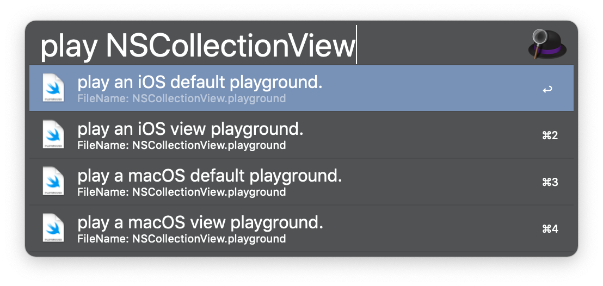

# Alfred-Playground

Create a Swift Playground Template for iOS or macOS. 

### Support

1. Black iOS playground
2. Single View iOS playground
3. Blank macOS playground
4. Single View macOS playground

### Prerequisite

After installation, just go to the workflow page, add a global variable named PLAY_ROOT, DO NOT REMOVE other templates, like below.

Done.

Click Play to trigger, then input name, or else workflow will generate MyPlayground.playground.  Hit Enter then.

Combine with modifier when you select the option, workflow will just download template and open the folder where it is.

[Download here](https://github.com/hechen/Alfred-Playground/raw/master/Playground.alfredworkflow)